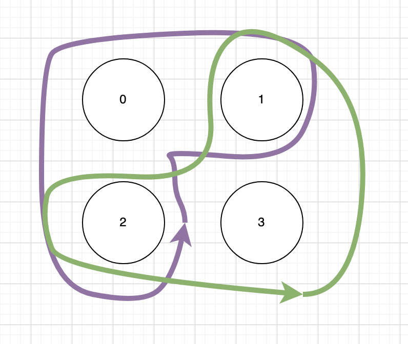

# MAEKAWA'S ALGORITHM
## Summary
- Similar to Ricart-Agrawala's Algorithm. However, Maekawa's Algorithm does not require to replies from all the processes in the cluster.
- The key idea of the algorithm is the Graph Topology in 2D Cartesian Grid of all the processes. We have a voting set for each process, a voting set is a set of all reachable processes from the current process. Specifically, the intersection of any two voting sets must be non-empty. Mathematically, there will always be a process between two processes that could hold one from another to access the Critical Section.

## Distributed system's properties
- Safety is guaranteed.
- Liveness: Does not guarantee since deadlock is possible in this implementation. However, there are variances of Maekawa could handle this.
- Ordering: Does not guarantee.

## Performance analysis
With N is the number of processes in the cluster.
- Bandwidth: O(sqrt(N))
- Client delay: O(1)
- Synchronization delay: O(1)

## Single Point of Failure
If all the processes in the cluster concurrently (simultaneously) request for the CS. This could possibly cause a deadlock.

## Example
Suppose we have two processes with ID 0 and 3 are accessing the Critical Section.

