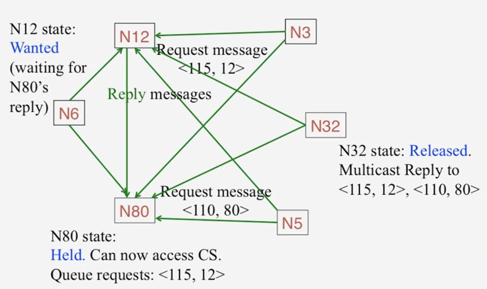

# RICART-ALGRAWALA'S ALGORITHM
- The key idea of the algorithm is: When the process wants to access the CS (Critical Section), it will send the request to all other processes in the cluster. When the number of replies of accepting message are sent back are equals to the number of processes in the group. It will have the access to the CS.
- The algorithm use the Lamport timetamps for causal or logical timestamp.
- The request message has the structure of a two-tuple <T_i, P_i> where T_i is the local timestamp of the process with ID P_i
- Requests in this system are granted in the order of causality. The P_i in the request T, P_i (Process's ID) is used to break ties. Because two different processes might have concurrent requests which might in fact end up having the same timestamp. You need to have a way to break ties. And the ID of the processes is used to break ties. 

## Distributed system's properties
- Safety is guaranteed.
- Liveness: In the worst case, the process needs to wait for N-1 other processes to finish their enter() actions and reply.
- Ordering: Requests with lower Lamport timestamps are granted earlier.

## Performance analysis
With N is the number of processes in the cluster.
- Bandwith: O(N)
- Client delay: O(1)
- Synchronization delay: O(1)

## Example

